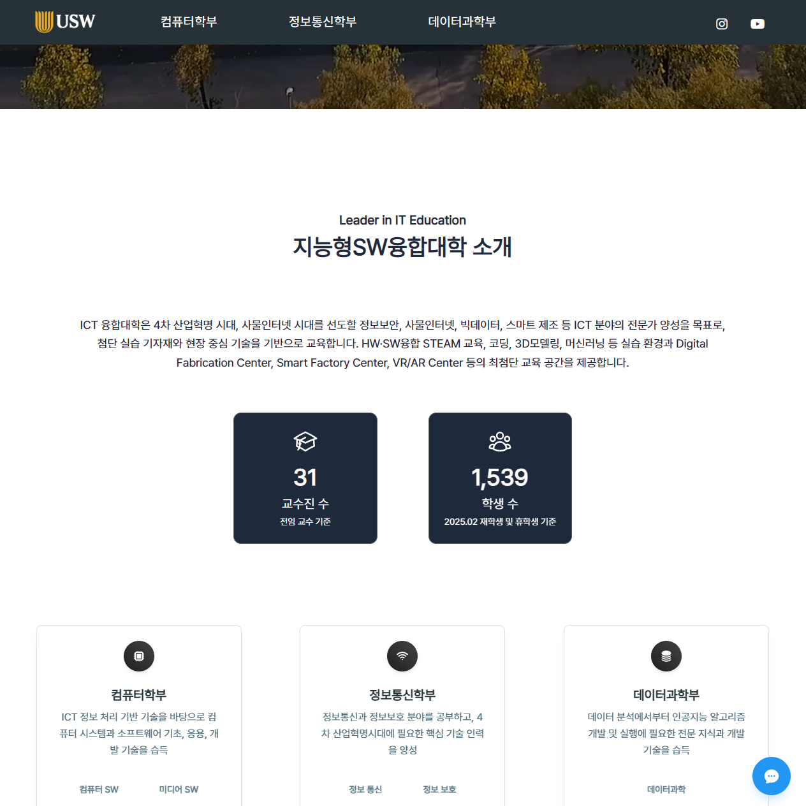

# 🎓 수원대학교 ICT 해커톤 - LLM을 이용한 지능형SW융합대학 웹사이트 🏫

[](https://reactjs.org/)
[](https://vitejs.dev/)
[](https://tailwindcss.com/)
[](https://www.javascript.com/)

LLM을 이용한 수원대학교 지능형SW융합대학의 정보 제공 및 편리한 기능을 제공하는 웹사이트입니다.  
학과 정보, 졸업 요건, 캠퍼스 네비게이션, 미니게임 등 다양한 기능을 통해 학생들의 적극적인 참여를 유도합니다! 🚀  
1주일  동안의 해커톤 대회 기간동안 제작하였습니다!  

본 프로젝트의 backend 레포지스토리는 [여기에서](https://github.com/2025-sw-hackathon/backend) LLM 레포지스토리는 [여기에서](https://github.com/2025-sw-hackathon/sw-hackathon-LLM) 확인할 수 있습니다

## 사이트 미리보기
https://sungjae01.github.io/sw-hackathon-react/



---

## 🤖 Past Presentation Slides


---

## 🤖 Function Description

### 🤖 정보 제공

- 학부학과, 졸업 요건 등 정보 제공

---

### 🤖 수벅수벅

- 캠퍼스 내 건물 간 이동 시간 계산을 통해 연강을 잡으면 안되는 곳을 알려줌

---

### 🤖 딸깍

- 학과별 오락용 클릭 배틀

---

### 🤖 수워나이

- 학교 생활에 필요한 졸업 요건, 학과 전화번호 등등 AI가 답변하는 기능


---

## ✨ 주요 기능

- 🏠 **홈페이지**:
    -   지능형SW융합대학 소개
    -   주요 학과(컴퓨터SW, 미디어SW, 정보통신, 정보보호, 데이터과학) 바로가기
    -   캠퍼스 주요 건물 및 시설 안내
  
- 🏛️ **학과 소개**:
  -   **컴퓨터학부**: 컴퓨터SW, 미디어SW
  -   **정보통신학부**: 정보통신, 정보보호
  -   **데이터과학부**: 데이터과학
  -   각 학과(부)별 상세 소개, 커리큘럼, 교수진 소개
  
- 🎓 **졸업 요건 확인**:
    -   학과별 상세 졸업 요건 안내
    -   개인별 이수 항목 및 졸업 가능 여부 체크리스트 제공
  
- 🗺️ **캠퍼스 길 찾기 (수벅수벅)**:
    -   교내 건물명 검색 및 위치 정보 제공
    -   선택한 출발지와 도착지 선택시 API를 통해 소요시간 및 직선거리 정보 제공
  
- 🎮 **클릭 배틀 미니게임**:
    -   학부 대항 실시간 클릭 경쟁 게임
    -   WebSocket 및 StompJS를 활용한 실시간 점수 동기화 및 순위 표시
    -   피버 모드, 사운드 등 다양한 재미 요소 포함
  
- 💬 **챗봇**:
    -  파인 튜닝된 LLM을 사용한 챗봇 사용자 인터페이스 제공
    -   request 대신 stream 방식을 사용하여 한글자씩 출력하도록 설정, 딜레이 감소 및 시각적 효과
  
## 🏗️ 프로젝트 구조 (Frontend - React)
```
sw-hackathon-react/
│
├── public/                # 이미지 에셋
│
├── src/
│   ├── assets/            # CSS 에셋
│   ├── data/              # JSON 데이터 (교수진, 학과 정보, 건물 정보 등)
│   ├── pages/             # 라우팅 단위의 페이지 컴포넌트 (Home, Graduate, PathFinder 등)
│   ├── widgets/           # 좀 더 복잡한 UI 단위 (cards, layout 등)
│   │
│   ├── App.jsx            # 메인 애플리케이션 컴포넌트
│   ├── main.jsx           # 애플리케이션 진입점 (ReactDOM.render)
│   └── mainRoutes.jsx     # 메인 라우팅 설정
│
├── index.html             # HTML 진입 파일
├── package.json           # 프로젝트 의존성 및 스크립트 관리
├── vite.config.js         # Vite 설정 파일
└── tailwind.config.js     # Tailwind CSS 설정 파일
```
## 🚀 설치 및 실행 방법

### 준비물

- Node.js (v18.x 이상 권장)
- npm

### 설치 단계

1.  **저장소 클론하기**
    ```bash
    git clone https://github.com/2025-sw-hackathon/sw-hackathon-react.git
    cd sw-hackathon-react
    ```

2.  **필요한 패키지 설치**
    ```bash
    npm install
    ```

3.  **서버 실행**
    ```bash
    npm run dev
    ```
    실행 후 브라우저에서 `http://localhost:5173`로 접속하여 웹사이트를 확인할 수 있습니다.

## 🔄 외부 API 및 서비스 연동

-   **수원맵 길찾기 API**:
    -   엔드포인트: `http://ahnai1.suwon.ac.kr:5041/suwon-navi`
    -   기능: 캠퍼스 내 건물 간 경로 정보 제공
-   **클릭 배틀 - WebSocket**:
    -   엔드포인트: `ws://ahnai1.suwon.ac.kr:5041/ws-click`
    -   기능: 클릭 배틀 게임의 실시간 데이터 통신 (점수, 팀 정보 등)
-   **더 많은 API는 [DOCS](https://documenter.getpostman.com/view/29676859/2sB2qUo57h)를 참고해주세요!**

## 🧩 사용된 주요 기술

-   **Core**:
    -   React (v18.2.0)
    -   JavaScript (ES6+)
    
-   **Styling & UI**:
    -   Tailwind CSS (v3.3.4) 
    
-   **Routing**:
    -   React Router DOM (v6.17.0)
    
-   **Real-time Communication**:
    -   StompJS (v7.1.1)
    
-   **Build Tool & Development**:
    -   Vite (v6.3.5)
    
-   **Package Manager**:
    -   npm

## 🌟 특징

-   **직관적인 UI/UX**: Tailwind CSS를 활용하여 깔끔하고 사용하기 쉬운 인터페이스를 구현
-   **모바일 맟춤 UI**: 모바일 맟춤 UI를 설계해 모바일에서도 깔끔한 UI를 제공
-   **웹소켓 실시간 처리**: 웹소켓을 통해 모두가 sync된 값을 받으므로써 실시간으로 학생들이 클릭하면 해당 값이 올라가는게 다 같이 공유됨
-   **비동기 처리 API**: 소요 거리와 클릭 배틀 초기값은 비동기로 처리함으로써 성능을 최적화
-   **모듈화된 컴포넌트**: 재사용 가능한 컴포넌트 설계를 통해 유지보수성과 확장성을 고려

## 🔧 문제해결 팁

-   **의존성 설치 문제**: `node_modules` 폴더와 `package-lock.json` 파일을 삭제한 후 `npm install`을 다시 시도해보세요.
-   **Vite 서버 시작 안될 때**: 포트 충돌이 있는지 확인하거나, 캐시를 정리해보세요 (`npm cache clean --force` 후 재시도 또는 Vite 캐시 삭제)
-   **API 연동 오류**: 브라우저 개발자 도구의 네트워크 탭에서 API 요청 상태 및 응답을 확인하여 이슈를 등록하세요.

## 🤝 기여하기

언제든지 버그 리포트, 기능 제안, Pull Request를 환영합니다! 기여하고 싶으시다면 다음 단계를 따라주세요:

1.  저장소 포크하기
2.  기능 브랜치 생성하기 (`git checkout -b feature/amazing-feature`)
3.  변경사항 커밋하기 (`git commit -m 'Add some amazing feature'`)
4.  브랜치에 푸시하기 (`git push origin feature/amazing-feature`)
5.  Pull Request 열기

## 📝 라이선스

이 프로젝트는 [MIT 라이선스](LICENSE) 하에 배포됩니다.

## 🙏 감사의 말

-   해커톤을 주최해주신 안홍렬 교수님과 IT관련 동아리 분들께 감사드립니다!
-   그리고 좋은 결과 받을 수 있게 같이 해커톤 참가해서 열심히 개발에 임해준 우리 1조 팀원들 너무 수고했어요!!
-   대상 [상장](https://github.com/SungJae01/sw-hackathon-react/blob/main/2025-1%20%E1%84%92%E1%85%A2%E1%84%8F%E1%85%A5%E1%84%90%E1%85%A9%E1%86%AB%20%E1%84%83%E1%85%A2%E1%84%89%E1%85%A1%E1%86%BC.pdf)

---

⭐ 이 프로젝트가 유용하다고 생각되시면 Star를 눌러주세요! ⭐
